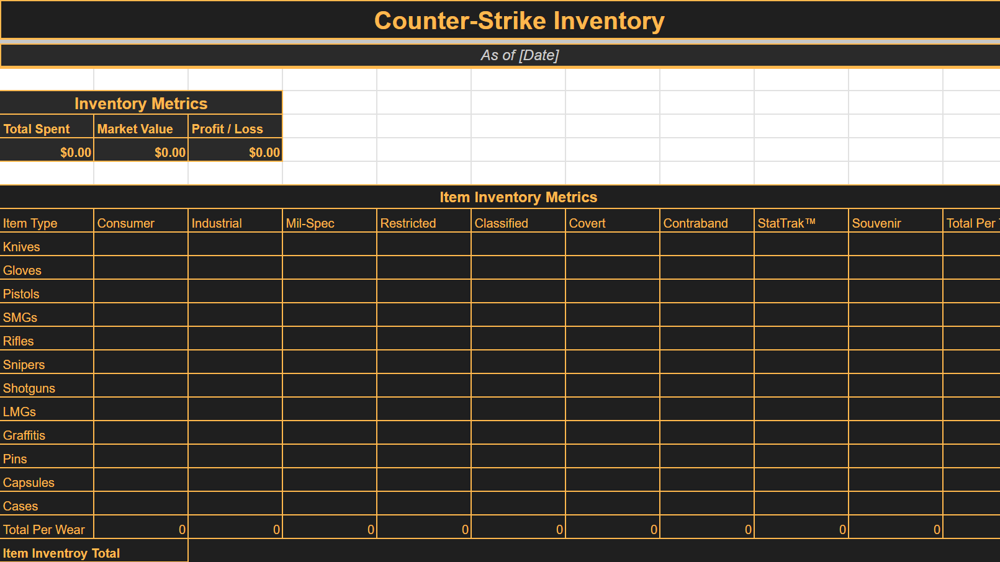
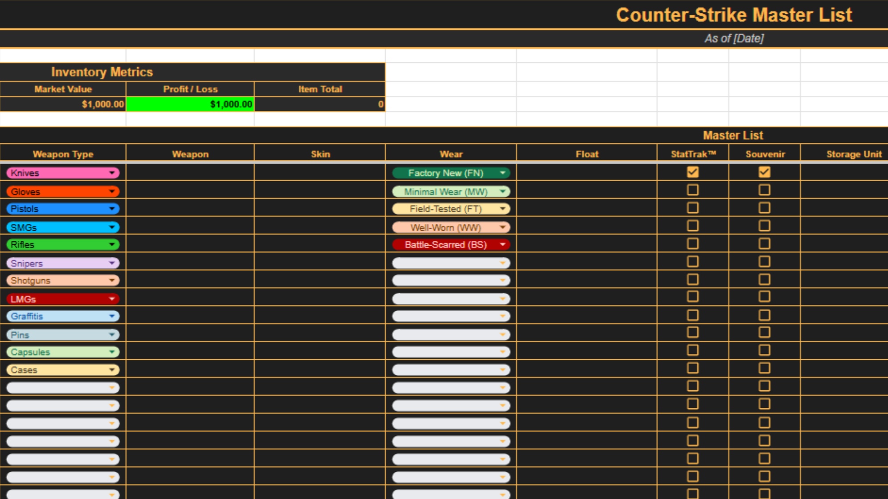
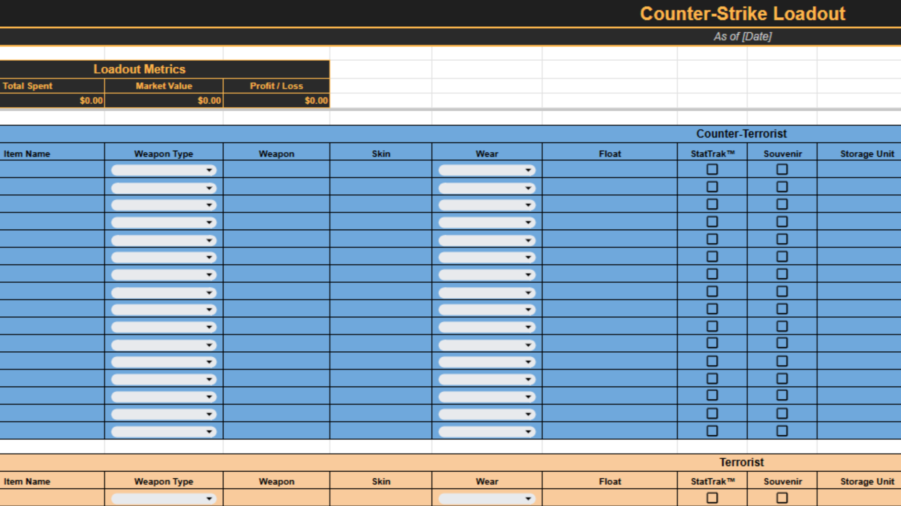

# 🎮 Counter-Strike Inventory Tracker 📊

 
  

  

 
 

> Track, analyze, and optimize your Counter-Strike inventory with ease.

A **Counter-Strike inventory tracker built in Excel and Google Sheets**, designed to help **players and teams** manage inventory efficiently.
Features **automated calculations** for profit/loss, **trade tracking**, and flexible organization for items, cases, and cosmetics.

---

## 📌 Motivation

This project started as a personal tool for managing my own Counter-Strike inventory.

After discussing with friends and other players, I noticed a recurring problem: there was no complete and customizable system for tracking items, trades, and profitability in one place. Existing online tools were either too limited, subscription based or overly complex.

I initially experimented with AI-generated templates, but they lacked the structure, clarity, and consistency needed for real use!

Another key consideration was accessibility. Counter-Strike has a wide player base across different age groups, and many users simply wanted something simple, intuitive, and reliable without unnecessary complexity.

To address this, I built a spreadsheet focused on:

- Simplicity and usability  
- Structured and scalable data design  
- Meaningful insights such as profit and ROI

What started as a small personal project evolved into a polished, flexible tracking system that can be used and extended by others.

---

## ✨ Features

- 📦 Track inventory (items, cases, cosmetics)  
- 💰 Automated calculations:
  - Purchase price  
  - Current market value  
  - Profit / loss  
- 🔄 Trade tracking and inventory management  
- 📊 Clean and scalable spreadsheet structure  
- 🤝 Contribution workflow with review and approval system

---

## 📂 Spreadsheet

The official Counter-Strike Inventory Tracker spreadsheet is available here:

👉 **[Open in Google Sheets](https://docs.google.com/spreadsheets/d/1FUhwWi9YzfkHnesqfPGaWub7LKwah8y3D4wH4mGlZS0/edit?usp=sharing)**  
👉 **[Download Excel Version](data/cs-inventory-tracker.xlsx)**

- Works in **Microsoft Excel** and **Google Sheets**  
- No installation required  
- Beginner-friendly and fully customizable  

> Future improved versions can be submitted to the `contributions/` folder. Contributions require approval before merging.

---

## 🤝 Contribution Workflow

1. Contributors can propose improved spreadsheets in the `contributions/` folder  
2. Open a Pull Request with a clear description of changes or enhancements  
3. Only approved contributions will be merged to maintain quality and consistency

For full guidelines, see 👉 [CONTRIBUTING.md](docs/CONTRIBUTING.md)

---

## 🖼️ Screenshots

### Overview

### Master List

### Loadout

> 🚧 More screenshots coming soon...

---

## 📜 License

This project is licensed under the **MIT License**.  
👉 [View License](LICENSE)